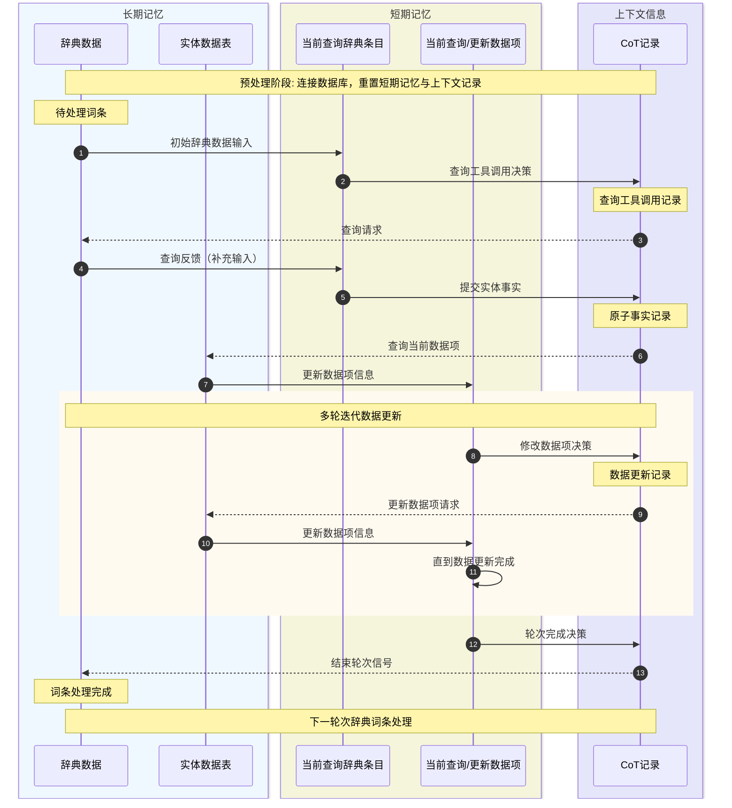

# 官制数据结构化代理文档

2026-02-11 修订版本

使用代理系统，从《宋代官制辞典》数据中提取官制信息，并转化为结构化数据。

主要调整：
将数据结构逻辑从时间段改为时间点，即某个点上发生了什么变化；
包括在那个时间点，整体的始置罢置，属性发生变化，以及词条关系变化；
索引依赖信息关联到时间点数据项上；

改为记录变化后，仅在时间点上记录相应发生改变的属性的值，其他属性留空，代表自动继承之前的属性信息；


## 数据结构

### 输入数据（已完成）

输入数据包含一项，即《宋代官制辞典》书本经过 OCR 处理后的结构化数据。

目前使用 OCR 获取了其中第八至十编的内容，并转化为了半结构化数据，存储在 Song_Bureaucracy_Dictionary 表中。
后续可以进一步扩展到整本书。
目前包含 833 个词条，并与书籍目录进行了对照，完成了初步校验。

| 字段名 | 类型 | 约束 | 说明 |
| :--- | :--- | :--- | :--- |
| id | INTEGER | PK, AI | 唯一索引 |
| title | TEXT | - | 词条在《辞典》中的名称 |
| catalog | TEXT | - | 词条在《辞典》中的目录结构 |
| page | TEXT | - | 词条在《辞典》中的页数 |
| text | TEXT | - | 词条名称后紧跟的说明文本 |
| fields | TEXT | json2str 结构字符串 | 词条带有小标题的文本信息集合 |

目前上述数据在 SQLite 数据库中\
```python
db_path = r"D:\git-projects\vis-context-agent\song-bureaucracy\data\database\song_bureaucracy_dictionary.db"
table_name = "chapter8t10"
```

```sql
CREATE TABLE IF NOT EXISTS chapter8t10 (
  id INTEGER PRIMARY KEY AUTOINCREMENT,
  title TEXT NOT NULL,
  catalog TEXT NOT NULL,
  page TEXT NOT NULL,
  text TEXT NOT NULL,
  fields TEXT
)
```

### 输出数据格式

整体架构为：词条-时间点-依赖；其中时间点包含属性数据和关系数据，分为两张表；

因此总共四张数据表
  * Entities 主词条表（包含机构或官职词条）
  * Timepoints 词条时间点表（和主词条关联，记录单个词条在具体时间点上发生的变化）
  * Relationships 词条关系表（和时间点关联，记录两个词条在具体时间点上的关系变化）
  * Citations 引用表（关联词条时间点或词条关系，记录对应的史料依据）

#### A. Entities (主词条表)
存储机构或官职的静态身份。

| 字段名 | 类型 | 约束 | 说明 |
| :--- | :--- | :--- | :--- |
| id | INTEGER | PK, AI | 唯一索引 |
| title | TEXT | NOT NULL | 词条名称（如：枢密院、都督府） |
| type | TEXT | - | 词条类型：'机构' 或 '官职' |

#### B. Timepoints (时间点表)
关联某个主词条，记录其在某个时间点上的属性变化。

| 字段名 | 类型 | 说明 |
| :--- | :--- | :--- |
| id | INTEGER | PK, AI。关系表与引用表关联的核心 ID |
| entity_id | INTEGER | FK，关联的主词条 |
| time | TEXT | 时间点（文字描述，如“建炎元年正月”） |
| event | TEXT | 描述状态变化的事件（如“设立”、“改名自...”） |
| prev_id | INTEGER | FK，前一个时间点 ID |
| succ_id | INTEGER | FK，后一个时间点 ID |
| attr_category | TEXT | 具体属性值，机构或官职名的细节分类（如：官司名，官署名，官职名，军职名，军职差遣名等） |
| attr_officer_type | TEXT | 具体属性值，官职分类：差遣官或阶官 |
| attr_grade | TEXT | 具体属性值，官职品阶描述（如：正三品、从五品等） |

## C. Relationships (关系表)
记录时间点之间的二元连接。

| 字段名 | 类型 | 说明 |
| :--- | :--- | :--- |
| id | INTEGER | PK, AI |
| subject_id | INTEGER | FK，主体切片 ID (Timepoints.id) |
| object_id | INTEGER | FK，客体切片 ID (Timepoints.id) |
| relation_type | TEXT | 上下级机构关系（机构-机构），编制隶属关系（机构-官职）或 前后演变关系 或 统称与实例关系 |
| staff_quota | INTEGER | 编制关系中的官职人数 |
| staff_type | TEXT | 编制关系中的职位类别，如官或吏 |

## D. Citations (引用表)
记录所有数据的史料依据。

| 字段名 | 类型 | 说明 |
| :--- | :--- | :--- |
| id | INTEGER | PK, AI |
| target_table | TEXT | 关联的表名 ('Timepoints' 或 'Relationships') |
| target_id | INTEGER | 对应表中的行 ID |
| citation | TEXT | 引文出处（如《宋代官制辞典》111页，枢密院条目，执掌字段） |
| quotation | TEXT | 史料原文内容 |
| note | TEXT | 必要的考证说明或备注 |

## 数据库接口

针对数据结构，提供查询和修改的函数，在原有数据表格上进行信息汇总；

### 查询《辞典》原始文献
辞典数据表中包含不可被更改的数据，源自《辞典》书籍的 OCR 结果。
目前包含的第八至十编的 833 个条目，可以通过“名称+所在页码”的方式唯一索引。

查询接口：search_dictionary(title, page)

返回值： 词条对象结构

```javascript
interface DictionaryEntry{
  id: str
  title: str
  catalog: str
  page: str
  text: str
  [opt_field_name]: str
}
```

转为结构化文本（用于输出到屏幕或构建提示词）
```text
{辞典中的词条名称}
文本来源：{辞典中的目录结构} {辞典中的页数}页
基本介绍：{辞典中的 text 域的文本}
{其他域名}：{辞典中的其他域名对应的文本}
```

```python
f"""{entry["title"]}
文本来源：{entry["catalog"]} {entry["page"]}页
基本介绍：{entry["text"]}
{"\n".join([f"{key}: {value}" for key, value in entry["fields"].items()])}
"""
```

### 查询数据项
查询数据表中一个词条下的全部信息；
通过在词条目录中找到对应词条的具体索引 id 后直接通过 id 进行查询；

查询接口：get_entity(id)

返回值：该词条的基础信息，以及全部重要时间点上的信息变化；

从数据库中获取
  - Entities 表中对应的条目信息
  - Timepoints 中以对应 id 为关联的所有时间点数据项
  - Relationships 中以上述时间点为关联的所有关系数据项
  - Citations 中以上述时间点和关系为关联的所有引用依赖数据项

按照时间点组织信息，即当前词条在每个时间点发生了什么变化，依赖引用信息是什么；

```text
# {词条名称}
索引：{词条索引 id}
类型：{词条类型（机构或官职）} {词条具体分类名}

## {时间点 id} {时间点文本} {时间点事件文本}

{关系 id} {变更关系名} {变更关系值}

{变更属性名} {变更属性值}

{引文 id} {引用材料出处} {引述文本}

## 其他时间点文本

```

### 更新数据
向输出数据表中插入新的条目或修改已有的条目；
其中原子操作包含（并非实际调用接口）
  * 向某表中插入一条新的数据
  * 更新某表中的一条数据
  * 移除某表中的一条数据

具有实际语义的操作包括（实际调用接口）
  * 创建新词条
  * 创建词条时间点
  * 更新时间点属性
  * 更新时间点关系
  * 添加引用依赖

这些操作包含多条原子操作，并确保数据项之间的关联；

#### 创建新词条

向 Entities 表中添加项；仅需词条名称和类别（机构或官职）；在添加前需要确认现有表中不包含该词条，或确认该词条与现有词条并非指向同一个机构或官职（同名不同体）；最好能够在名称上体现区别；
创建 Entity 项会同步向 Timepoints 中添加一个占位时间点，设置 time 为 “未知” 并设置 event 为 “占位”，用于在不明确其时间点时更新属性；

接口：create_entity(title, type)

返回值：创建该词条后，自动调用词条查询功能，返回查询结果

#### 创建词条时间点

创建指定词条的时间点，需要指定该时间点的插入位置（在指定的时间点之前，如果留空在插入在最后）；
如果当前词条的时间点仅包含占位时间点（即 time="未知", event="占位"）则将替换该时间点，并继承原占位时间点的其他属性值；
*理论上应当使用更新时间点方法来更新第一个占位时间点的属性*；

接口：create_timepoint(entity_id, succ_timepoint_id, time, event, citation, quotation)

返回值：创建该时间点后，查询该词条并返回结果

其中 succ_timepoint_id 为插入位置的后一个时间带你，如果为空 NULL 则插入到最后面；

#### 更新时间点属性

更新时间点上的属性值，同时需要写入引用依赖信息；

接口：update_timepoint_attr(timepoint_id, attr_key, attr_value, citation, quotation, note)

返回值：更新该时间点后，查询该词条并返回结果

会同步更新 timepoints 表和 citations 表；

#### 添加时间点关系

添加时间点之间的关系信息，同时需要写入引用依赖信息；

接口：create_timepoints_relationship(timepoint_id_1, timepoint_id_2, relation_type, staff_quota, staff_type, citation, quotation)

返回值：更新该关系后，同时查询两个相关词条，并返回结果；

当 relation_type 为 编制隶属关系 时，需要进一步填写 staff_quota 和 staff_type 属性；
citations 表自动更新；
目前只支持追加新的属性，修改或移除已有的关系暂时不提供；

#### 添加引用依赖

当有新的证据可以证实已有的属性或关系时，可以追加引用依赖；
如果当前引用依赖与现有信息存在冲突，同样可以追加引用依赖；但是目前不对已有的信息进行修改，而是标记为可能存在冲突的属性值；留到以后的步骤再检查判断；

接口：append_citation(target_table, target_id, citation, quotation, note, conflict_flag)

返回值：查询相关的词条，并返回其值；

如果发现现有值和引用冲突，需要将 conflict_flag 设为 true，同时：
对于属性值，可以通过接口 update_timepoint_attr 更新属性值，也可以选择不更新，保留冲突；
对于关系信息，则不更新属性值，仅添加引用依赖，并标记冲突；

## Agent 架构与上下文

整个 Agent 包含两层，内层又包括两步。
外层维护待处理的《辞典》数据，即规划 833 条辞典条目作为数据；
内层首先分析输入数据，获取缺少的信息，并将信息转为中间状态（原子事实）；
随后，再将原子事实作为输入，获取相关的当前数据表条目信息，构建工具调用命令，并更新修改数据表。

上下文信息（短期记忆 或 全局变量）由外层向内层依次包括
  * 外圈
    * 《辞典》数据索引和处理情况
    * 数据表索引信息
  * 内圈
    * 输入或查询《辞典》数据得到的结果
    * 查询或更新数据表数据的结果
    * CoT 记录
      * 工具调用情况和反馈状态
    * 第一步产出的中间结果（原子事实）

### 原子事实内容
引用信息，引用原文，机构或官职（组），（如果存在）时间点描述，属性（变化）或关系（变化）

并非标准的结构化数据，还是以文本形式；允许灵活组织，如一条引用对应多个属性或关系信息；

## 提示词构建

### 内圈第一步
  * 角色定义与任务描述：根据提供辞典数据条目，主动获取缺失的辞典条目信息，并提取原子事实
  * 全局流程与基本准则
  * 相关工具定义
  * 上下文-辞典索引与状态
  * 上下文-当前待处理的辞典数据详情（包含原始输入和主动查询结果）
  * 当前任务描述：查询补充缺少的辞典信息后，将辞典信息转化为原子事实
  * 历史对话轮次（对于工具调用结果，若成功则仅保留调用记录，否则保留报错信息；成功调用的结果会反应在上下文信息中）
  * 上下文-目前提取出来的原子信息
  * 输出要求

### 内圈第二步
  * 角色定义与任务描述：根据提取的原子事实，确认数据表中实体的当前状态后，通过 API 插入或更新数据项
  * 全局流程与基本准则
  * 相关工具定义
  * 上下文-数据表实体索引信息
  * 当前任务描述：根据原子信息，补充或更新数据项
  * 上下文-提取出来的原子信息
  * 上下文-目前查询或更新后的数据项实体信息
  * 历史对话轮次
  * 输出要求

