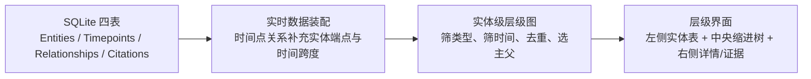

# v2 层级关系显示逻辑说明

本文记录 `song-bureaucracy-visualization-v2` 当前代码实际执行的层级关系显示逻辑。它描述的是现状，不是理想模型或历史设计稿。

## 1. 结论先行

当前“层级结构”视图不是直接把数据库的 `Relationships` 画出来，而是经过四层转换：



最重要的三个边界是：

1. 数据库关系的端点是**时间点**，层级树将它折叠成**实体到实体**的边。
2. 中央层级树只接收 `上下级机构`、`编制隶属`、`统称与实例`；`前后演变`不进入层级树。
3. 青绿色“所选时段有记录”圆点只依据实体在区间内的 `exact` 精确纪年事件；它和“层级边是否在当前时段显示”是两套不同判定。

## 2. 当前实现文件

| 层次 | 文件 | 当前职责 |
| --- | --- | --- |
| SQLite → 前端数据 | `../export_visualization_data.py` | 读取四表、即时标准化时间、把时间点关系补充为实体端点、合成关系时间跨度 |
| 实时服务 | `../serve_visualization_v2.py` | 只读访问 SQLite，提供 `/api/data` 与 `/api/version`，数据库稳定后刷新缓存 |
| 实体层级图 | `src/utils/hierarchy.js` | 筛选层级关系、按时间过滤、折叠到实体、去重、计算根、孤立实体和主父链 |
| 层级视图 | `src/components/HierarchyView.vue` | 左侧列表、中央缩进树、关系证据栏及交互 |
| 页面联动 | `src/App.vue` | 时间区间、活跃实体、搜索、右侧实体详情、沿关系跳转、实时/离线数据切换 |

## 3. 数据从数据库到浏览器的转换

### 3.1 数据库原始结构

- `Entities` 保存实体：`机构`或`官职`。
- `Timepoints` 保存实体在某个时间表达下的状态或事件。
- `Relationships.subject_id` 和 `Relationships.object_id` 指向 `Timepoints.id`，不是 `Entities.id`。
- `Citations` 可以挂在时间点或关系上。

因此数据库中的一条关系本质上是：

```text
主体实体的某个时间点 -> 客体实体的某个时间点
```

### 3.2 导出后的 relation 对象

`build_payload()` 连接两端时间点及实体，给每条关系生成以下前端字段：

| 字段 | 来源/含义 |
| --- | --- |
| `subjectId` / `objectId` | 数据库两端时间点 ID |
| `subjectEntityId` / `objectEntityId` | 两端时间点所属实体 ID |
| `subjectTitle` / `objectTitle` | 两端实体名称 |
| `subjectType` / `objectType` | 两端实体类型 |
| `type` | `relation_type` |
| `staffQuota` / `staffType` | 编制员额及员额类型 |
| `yearStart` / `yearEnd` | 由两端时间点的标准化区间合成的关系显示跨度 |
| `citations` | 挂在该关系上的全部引用 |

### 3.3 关系时间跨度如何合成

`relation_span()` 对两端时间点执行如下规则：

1. 忽略没有 `yearStart` 的端点。
2. `yearStart` 取所有有纪年端点的最小起始年。
3. `yearEnd` 取所有有纪年端点的最大结束年；缺少结束年时用该端点起始年。
4. 两端都没有纪年时，关系跨度为 `(null, null)`。

这得到的是两端时间的**外包络**，不是两个端点时间区间的交集。例如主体在 1000 年、客体在 1050 年，关系会被表示为 1000—1050 年。

### 3.4 实时数据与离线快照

- 页面优先请求 `/api/data`。
- 后端只读打开 `vis/data/song_bureaucracy_visualization.db`。
- SQLite 主文件或 WAL 改变后，默认等待状态稳定 2 秒再重建完整 payload。
- 前端每 1.5 秒请求 `/api/version`；版本改变时重新加载数据。
- 实时接口不可用时，页面回退到 `public/data/song-bureaucracy.json`，状态栏显示“离线快照”。
- 接口恢复后会自动切回实时数据库。

## 4. 哪些关系进入中央层级树

`HIERARCHY_TYPES` 只包含三种类型：

| 关系类型 | 规定方向 | 树中的含义 |
| --- | --- | --- |
| `上下级机构` | `subject → object` | 上级 → 下级 |
| `编制隶属` | `subject → object` | 机构 → 属官/编制成员 |
| `统称与实例` | `subject → object` | 统称/模板 → 具体实例 |

`前后演变`表示时间演化，不是组织层级，因此不进入中央树。但它仍会出现在右侧实体详情的关系列表和事件详情中。

构图时还会丢弃以下边：

- 主体实体与客体实体相同的自环；
- 主体或客体实体在 `dataset.entities` 中不存在的悬空边；
- “所选时段结构”模式下未通过时间过滤的边。

## 5. 两种结构范围

### 5.1 所选时段结构

这是进入层级视图时的默认模式。底部年表的 `[起始年, 结束年]` 会传给 `buildEntityGraph()`。

#### 有明确关系跨度

只要关系区间与所选区间相交，就显示：

```text
relation.yearStart <= selectedEnd
且
(relation.yearEnd ?? relation.yearStart) >= selectedStart
```

#### 关系两端都没有纪年

只有当主体实体和客体实体都被判定为在所选区间“存续”时才显示。

实体存续范围使用 `entity.yearMin/yearMax`。这两个值只由该实体的 `exact` 精确纪年事件计算：

```text
entity.yearMin <= selectedEnd
且
(entity.yearMax ?? entity.yearMin) >= selectedStart
```

完全没有精确纪年活动范围的实体，不能通过这项无纪年关系回退判定。

### 5.2 历时全貌

切换到“历时全貌”后，`buildEntityGraph()` 不接收时间范围，三种层级关系全部参与构图。

历时模式仍然保留底部当前区间，并继续用它：

- 绘制青绿色活跃圆点；
- 决定左侧实体排序中谁优先。

所以“历时全貌”只取消**边的时间过滤**，并不取消当前区间的活跃提示。

## 6. 层级边的实体级折叠与去重

通过类型和时间过滤后，每条时间点关系被折叠为：

```text
parentEntityId -> childEntityId
```

前端同时建立：

- `childrenOf[parent]`：该实体向下有哪些子实体；
- `parentRelsOf[child]`：该实体有哪些父关系；

### 6.1 下级边去重

`childrenOf` 按以下键去重：

```text
(父实体, 子实体, 关系类型)
```

同一键对应多条时间点关系时：

- `relationIds` 合并，供“证”按钮一次查看多期证据；
- 不同 `(yearStart, yearEnd)` 合并进 `periods` 并按起始年排序；
- 任一记录无纪年时，`hasUndated = true`；
- 员额优先保留第一条非空 `staffQuota`，同时取该条的 `staffType`。

不同关系类型不会互相去重。同一父子既有“上下级机构”又有“统称与实例”时，树中仍是两条不同语义的边。

### 6.2 父关系没有做同样的去重

`parentRelsOf` 保留通过过滤的原始关系记录。它用于选择主父和计算“另有 N 个上级”。因此同一父子类型在多个时间点重复出现时，可能被算作多条父记录。

## 7. 根、孤立实体、主父与多父

### 7.1 根实体

根实体必须同时满足：

- 在 `childrenOf` 中有下级；
- 在 `parentRelsOf` 中没有任何上级。

根集合会随“所选时段结构/历时全貌”切换而变化。

### 7.2 无层级实体

既不作为任何层级边的父端，也不作为任何层级边的子端，就进入 `isolated`。

左侧列表会把这些实体放到分隔线以下，并降低文字颜色。这里的“无层级”是相对于当前结构范围而言，不代表数据库里没有时间点或其他类型关系。

### 7.3 主父

一个实体可能有多个上级。当前代码不会显示多父网络，而是为面包屑选一个“主父”：

1. 将该实体的父关系按 `relationId` 升序排序；
2. 取最小 `relationId` 对应的父实体；
3. 沿主父递归向上形成面包屑；
4. 使用 `seen` 集合防止循环。

“主父”只是技术上的稳定选择，不代表史料优先级、行政级别或时间上的主从关系。

主父以外的记录作为节点徽标显示“另有 N 个上级”，鼠标提示中列出名称。

## 8. 左侧实体列表

左栏由两段组成：

1. 当前结构范围内至少参与一条层级边的实体；
2. 当前结构范围内不参与层级边的实体。

两段内部使用相同排序：

1. 当前所选时间区间内有 `exact` 记录的实体优先；
2. `eventCount` 多的实体优先；
3. 中文标题按 `localeCompare(..., "zh")` 排序。

实体类型的形状：

- 机构：方角小方块；
- 官职：圆形标记。

青绿色圆点表示该实体在当前区间内至少有一条 `exact` 精确纪年事件。`range`、`undated`、`pre_song`、`unresolved` 都不产生这个圆点。

左栏宽度为 210px，可收起到 15px。

## 9. 中央缩进树

### 9.1 焦点结构

中央不是一次展示全部根树，而是展示“焦点实体 + 它的全部下级”。初始没有焦点时显示操作提示。

焦点可以来自：

- 点击左侧实体；
- 顶部搜索结果；
- 右侧关系跳转；
- 面包屑；
- 子节点旁的“以此为中心”；
- 深链 `?view=hierarchy&entity=实体ID`。

建立新焦点时：

- 清空关系证据栏；
- 沿 `childrenOf` 遍历，默认展开整棵下级树；
- 同步打开该焦点实体的右侧详情；
- 使用实体 ID 集合防止展开阶段循环。

### 9.2 子节点排序

同一父节点的子节点按以下顺序：

1. 关系类型：`上下级机构` → `编制隶属` → `统称与实例`；
2. 子实体 `eventCount` 降序；
3. 同分时继承构图阶段已有的中文标题顺序。

### 9.3 树的拍平与连线

代码先递归建立下级数据树，再按深度优先顺序拍平成行。每行固定 34px 高，每一层缩进 64px。

连线不是自由图布局，而是由每行的 `guides` 和 `isLast` 生成直角肘线：

- 祖先层后面还有兄弟时，竖线继续贯通；
- 当前节点用半行竖线和水平短线接入；
- 末位兄弟在节点高度中点停止竖线。

因此不会出现网络图式交叉线，但同一实体经不同路径到达时仍可能在树中重复出现。当前路径集合会阻止在同一路径中形成环。

### 9.4 展开上限

单个节点最多渲染 50 个直接下级。超过时追加一个禁用行：

```text
…另有 N 个下级
```

当前数据库的实体级最大直接下级数为 37，尚未触发该上限。

## 10. 节点和关系的视觉编码

### 10.1 实体类型

| 类型 | 节点外形 |
| --- | --- |
| 机构 | 方角矩形、浅褐底 |
| 官职 | 胶囊圆角、近透明底 |

### 10.2 进入节点的关系类型

| 关系 | 颜色/线型 | 图标 |
| --- | --- | --- |
| 上下级机构 | 深褐实线左边条 | 建筑 |
| 编制隶属 | 橙色虚线左边条 | 人形 |
| 统称与实例 | 灰褐点线左边条 | 交叠方框 |

焦点节点使用深褐底和浅色字。右侧详情当前选中的非焦点节点增加内描边；从右侧关系列表悬停联动到的节点使用锈红外框、底色和阴影。

### 10.3 节点徽标

徽标内容按顺序拼接：

1. 历时模式下的关系时期；
2. 编制隶属的员额，如 `2员`；
3. `另有N个上级`。

历时关系时期显示规则：

- 无明确时期：`时间未明`；
- 一至两期：逐期显示；
- 超过两期：显示第一期及“等 N 期”；
- 同时存在无纪年记录时追加“另有时间未明记录”。

## 11. 点击和联动

### 11.1 左侧实体

- 第一次点击非焦点实体：设为焦点、整树展开、打开右侧详情。
- 再次点击当前焦点：不重建树，只切换右侧详情的开/关。

### 11.2 中央树节点

- 点击节点主体：只切换右侧详情，不改变树的焦点。
- 有下级且不是当前焦点的节点，旁边显示“以此为中心”；点击后才重新以它为根展开。
- 点击三角：只展开/收起该节点，并关闭关系证据栏。

代码通过 `suppressNextFocus` 阻止“只查看详情”的节点点击被外部 `selectedEntityId` 监听器误判成重新聚焦。

### 11.3 面包屑

顶部面包屑显示当前图中按主父追溯得到的上级链。点击任一上级会把它设为新焦点并打开详情。

### 11.4 关系证据

每个非焦点子行有独立“证”按钮。点击后：

- 根据聚合边的 `relationIds` 找回原始关系；
- 按 `yearStart`、`relationId` 排序；
- 在树右侧固定证据栏展示关系方向、各期范围、出处、引文和备注；
- 没有引用时显示“该期关系暂无引文记录”。

再次点击同一“证”按钮或关闭按钮会收起证据栏。

### 11.5 右侧实体详情

右侧详情按实体 ID 扫描**全部数据库关系**，不是只扫描当前层级树，也不按当前时间范围过滤。因此会同时出现：

- 上下级机构；
- 编制隶属；
- 前后演变；
- 统称与实例；
- 其他未来新增的关系类型。

显示顺序固定为：`上下级机构` → `编制隶属` → `前后演变` → `统称与实例`，未知类型追加在后。

以当前实体为视角，方向标签为：

| 类型 | 当前实体是 subject | 当前实体是 object |
| --- | --- | --- |
| 上下级机构 | 下级 | 上级 |
| 编制隶属 | 属官 | 隶属于 |
| 前后演变 | 后继为 | 前身为 |
| 统称与实例 | 实例 | 统称 |

悬停右侧关系条目，会让另一实体在左栏中锈红高亮并滚动到可视区域；如果它也出现在当前中央下级树中，中央节点会同步高亮和滚动。点击关系条目，会把另一实体设为新的 `selectedEntityId`，层级树随之聚焦到该实体。

## 12. 右侧面包屑与中央面包屑的差别

中央 `HierarchyView` 的面包屑来自当前构图范围：

- 所选时段模式：只基于当前时段边；
- 历时模式：基于全部层级边。

页面右侧实体详情中的 `entityBreadcrumb` 使用 `App.vue` 创建的无时间过滤全历史图。因此在“所选时段结构”下，两处面包屑可能不同。这是当前代码的真实行为。

## 13. 当前数据库的实际规模

以下统计来自当前 `vis/data/song_bureaucracy_visualization.db`：

| 项目 | 数量 |
| --- | ---: |
| 实体 | 981 |
| 全部关系 | 1,177 |
| 进入层级构图的原始关系 | 1,063 |
| 实体级 `(父, 子, 类型)` 去重后层级边 | 1,050 |
| 历时层级相关实体 | 922 |
| 历时无层级实体 | 59 |
| 历时根实体 | 165 |
| 最大直接下级数 | 37 |

按类型：

| 类型 | 数据库关系数 | 实体父子去重后 |
| --- | ---: | ---: |
| 上下级机构 | 147 | 146 |
| 编制隶属 | 522 | 510 |
| 统称与实例 | 394 | 394 |
| 前后演变（不进树） | 114 | — |

以当前默认的 1132 年为例：

| 项目 | 数量 |
| --- | ---: |
| 通过时间过滤的层级关系 | 776 |
| 当前时段层级相关实体 | 704 |
| 当前时段无层级实体 | 277 |
| 有 `exact` 记录、显示绿点的实体 | 21 |

这解释了为什么工具栏可能显示数百个“所选时段有层级实体”，但“当前区间活跃”只有 21：前者统计通过关系跨度过滤后参与层级的实体，后者只统计当年有精确事件的实体。

## 14. 当前已知的显示边界与风险

### 14.1 关系跨度是外包络，可能显示过宽

两端时间点的最早起点到最晚终点被视作关系跨度，而不是取交集。两端纪年相距很远时，中间年份仍可能显示该边。

### 14.2 无纪年关系的回退使用实体精确纪年包络

无纪年边依赖实体 `yearMin/yearMax`，而该范围：

- 只统计 `exact` 事件；
- 不统计 `range` 事件；
- 用最早和最晚精确年份形成连续包络，不能表达中间断裂。

### 14.3 活跃圆点不表示关系在该时段有证据

绿点只说明该实体在所选区间有精确纪年事件。没有绿点的节点仍可能因为范围关系或无纪年关系回退而出现在树中；有绿点也不保证它参与当前显示的层级边。

### 14.4 主父由 ID 决定

多父实体的面包屑主父取最小 `relationId`，没有比较关系类型、时间接近度、证据质量或行政级别。

### 14.5 父关系计数可能包含重复时期记录

当前数据库有 11 个子实体存在重复的 `(父实体, 关系类型)` 时间点记录，共多出 13 条父记录。下级树已经聚合这些记录，但“另有 N 个上级”基于未去重的 `parentRelsOf`，数量和名称可能包含同一父实体的重复项。

### 14.6 右侧详情不受当前时间范围限制

中央树是当前时段结构时，右侧“层级关系”仍显示该实体的全部历时关系，并且包含 `前后演变`。其标题“层级关系”实际上覆盖的是“全部关系”。

### 14.7 实体级树会丢失时间点级上下文

中央树聚合相同实体父子类型的多条时间点关系，只用时期徽标和证据栏保留多期差异。若不同时间点的关系语义、员额或证据冲突，需要打开“证”栏逐条判断，不能只看节点本身。

## 15. 修改逻辑时的核查清单

修改层级显示后，至少核查：

1. 三种层级关系方向是否仍是 `subject → object`。
2. `前后演变`是否仍未误入组织树。
3. 当前时段和历时模式的边数量是否符合预期。
4. 下级边去重后，多期 `relationIds`、`periods`、员额和无纪年标记是否都保留。
5. 主父链、额外上级和环保护是否正常。
6. 左栏活跃排序、绿点和中央边过滤是否没有被混为同一概念。
7. 点击节点、点击“以此为中心”、点击右侧关系是否分别执行正确动作。
8. “证”栏能否显示聚合边的全部原始关系与引用。
9. 当前范围改变后，树、工具栏统计和活跃圆点是否一起刷新。
10. 实时数据库变化后 `/api/version` 是否更新，页面是否从实时数据重新构图。
